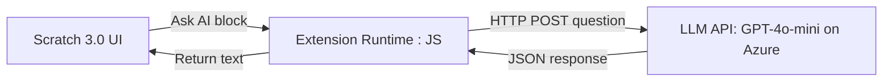

# vui-hoc-cung-AI Scratch Extension

> **Fun learning with AI**  
> A custom Scratch 3.0 extension that lets students ask questions and get answers powered by a GPT-4o-mini LLM.

[](https://thuytien-binhthuan.github.io/vui-hoc-cung-AI/scratch/)  
[](./LICENSE)

---

## 📖 Overview

This project is a fork of [dalelane/scratch-extension-development](https://github.com/dalelane/scratch-extension-development) repurposed to create a Scratch extension that:

- Adds an **“Ask AI”** block in the Scratch block palette  
- Sends a user-typed question to a GPT-4o-mini LLM API endpoint  
- Returns the AI’s response back into Scratch for display or further use


It’s been built as part of a competition entry to show initiative and to give Grade 1 students a fun way to practice subjects with the support from AI/LLM for explaination. I have a sample `.sb3` project demonstrates the extension in action:  
👉 [Run the demo project](https://thuytien-binhthuan.github.io/vui-hoc-cung-AI/scratch/)

---

## 🏗️ Architecture


1. **Scratch 3.0 UI**  
   - User drags the **“Ask AI”** block into their script.  
2. **Extension Runtime** (`your-scratch-extension/index.js`)  
   - Listens for the block event, captures the question string.  
   - Sends an authenticated `fetch()` request to the LLM API.  
   - Parses the JSON response and resolves it back to Scratch as a string.  
3. **LLM API**  
   - A simple REST endpoint (`API_BASE_URL`) protected by `API_KEY`.  
   - Internally forwards the prompt to the GPT-4o-mini model and returns the answer.

---

## 🔗 Open Source & Custom Development

- **Based on**  
  - [dalelane/scratch-extension-development](https://github.com/dalelane/scratch-extension-development): starter template, build scripts, and the demo HTML wrapper.  
  - Scratch’s unofficial extension loader in the offline editor.

- **My Own Work**  
  - **`your-scratch-extension/index.js`**: customized to call to and LLM endpoint and handle block’s logic.
  - **Azure Endpoint Setup**: Designing and deploying a custom LLM API endpoint on Azure, including OpenAI resource provisioning and Azure Functions integration.  
  - **`.sb3` Project**: custom Scratch project that uses the “Ask AI” block to quiz topics for elementary-level students(math problems, English, fun facts).  
  - **Live Deployment**: GitHub Pages setup under `/vui-hoc-cung-AI/scratch/` including a friendly UI wrapper (`src/index.html`) for non-technical users.  
  - **Documentation & Demo**: this README, automated build & deploy scripts, and demo link.

---

## 💡 Skills 
This project showcases my ability to:
- **Game Design**: Creating a multi-level .sb3 Scratch game that guides Grade 1 students through progressively challenging exercises in different subjects math, English, etc.


- **Deploy Azure LLM Endpoint**: Implementing Azure Functions to wrap the LLM API.


- **LLM Prompt Design**: Crafting prompts and parsing responses to ensure questions and answers are clear and engaging for elementary students.
- **UI Integration**: Learning how Scratch’s block rendering works, modifying `index.html`, and ensuring her extension loaded seamlessly in the Scratch UI.
- **Event Handling**: Writing JavaScript to listen for block events and pass data between Scratch and the extension runtime.  
- **Deployment Workflow**: Use automated scripts (defined in the original repo) for build, and publishing to GitHub Pages.


## 🌐 Extensibility & Collaboration
This GitHub Pages site and extension template are designed for everyone to build upon:

- **Add New Scratch Blocks**: Easily extend the Scratch palette by modifying src/extension.js to register additional LLM-powered blocks.
- **Customize Prompts**: Tailor prompts in the Azure Function (or your own API) to create new educational activities or storytelling experiences.
- **Fork & Share**: Clone this repo, create your own branches of extensions, and share them back via pull requests or GitHub Pages deployments.
- **Community Projects**: Encourage peers to contribute fun applications—games, quizzes, interactive stories—that leverage LLM APIs for dynamic content.

Use this as a launchpad to explore AI in Scratch and collaborate on innovative learning tools!
---

## 🚀 Live Demo

👉 Try the project and see her `.sb3` in action:  
**https://thuytien-binhthuan.github.io/vui-hoc-cung-AI/scratch/**

---

## 🛠️ Installation & Development

### 1. Clone the repo
```bash
git clone https://github.com/thuytien-binhthuan/vui-hoc-cung-AI.git
cd vui-hoc-cung-AI
```

### 2. Provision & build
```bash
# Install prerequisites (once)
./0-setup.sh

# Add or update npm deps
./1-add-dependency.sh

# Compile & bundle extension
./2-build.sh

# Run a local dev server
./3-run-private.sh

# Publish to GitHub Pages
./4-publish.sh
```

### 3. Create a Custom LLM API Endpoint on Azure

If you prefer to host your own LLM endpoint using Azure, follow these steps:

1. **Provision an Azure OpenAI Resource**  
   - In the Azure Portal, click **Create a resource → AI + Machine Learning → Azure OpenAI**.  
   - Select your subscription, resource group, region, and pricing tier.  
   - Wait for deployment to complete.  
2. **Deploy an Azure Function**  
   - Create a **Function App** (Compute → Function App) and choose a runtime (Node.js or Python).  
   - In the Functions blade, add a new HTTP-triggered function.  
3. **Implement Your Handler**  
   - Read the incoming `question` from the request body.  
   - Construct a child-friendly prompt, e.g.:  
     ```js
     const prompt = `You are a friendly tutor for Grade 1 students.

Student asks: "${question}"

Answer:`;
     ```  
   - Call the Azure OpenAI endpoint:  
     ```js
     const client = new OpenAIClient(
       process.env.AZURE_OPENAI_ENDPOINT,
       new AzureKeyCredential(process.env.AZURE_OPENAI_KEY)
     );
     const response = await client.getCompletions("gpt-4o-mini", { prompt, maxTokens: 150 });
     ```  
   - Return `{ answer: response.choices[0].text }` in the HTTP response.  
4. **Secure & Test**  
   - Store `AZURE_OPENAI_ENDPOINT` and `AZURE_OPENAI_KEY` as Function App settings.  
   - Obtain the function URL (including function key) and replace `API_BASE_URL` in your `.env`.  

---

## 📦 Usage in Scratch

1. Start the local server (`./3-run-private.sh`) at `http://localhost:8000/`.  
2. In the Scratch 3.0 offline editor, go to **Experimental → Load Unofficial Extension**.  
3. Enter your extension URL:  
   ```
   http://localhost:8000/extension.js
   ```
4. Look under **Extensions** for **“Ask AI”**.

```scratch
when green flag clicked
ask AI [What is 2+2?] and set [Answer v]
say (Answer)
```

---

## 🤝 Contributing

We welcome ideas, feedback, and pull requests! To contribute:

1. Fork the repo  
2. Create a feature branch  
3. Commit your changes  
4. Push and open a Pull Request  

---

## 📜 License

This project is released under the **Apache-2.0 License**. See [LICENSE](./LICENSE).

---

## 📬 Contact

For questions or feedback, contact **dtthuytien999@gmail.com**.  

